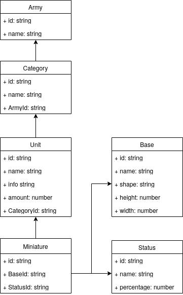

# miniWorkStatus project

This is my hobby project made with React and TypeScript. It is a tool used for keeping track of wargaming miniatures, and updating their statuses. 

## Backend

Proper backend has not been implemented yet. Currently I am using [JSON server](https://www.npmjs.com/package/json-server) as it provides all the functionality that I currently need out of the box (no autenthication or scheme validation).

## Basic idea

The tool is used to track the progress of your wargaming miniature armies.

First you can customize your global settings:

 1. Bases: What diffrent size of bases your miniatures have, such as 20mmx20mm rectangle or 50mm wide circle
 2. Statuses: What are the different states of your miniature projects, such as glued, base painted, colored, detailed, varnished, etc. and their percentage value of progress from out of the box to a complete miniature. 

Then you can start adding your armies, categories and units.

## Showcase

The data is stored in the following data format:

This template provides a minimal setup to get React working in Vite with HMR and some ESLint rules.

Currently, two official plugins are available:

- [@vitejs/plugin-react](https://github.com/vitejs/vite-plugin-react/blob/main/packages/plugin-react/README.md) uses [Babel](https://babeljs.io/) for Fast Refresh
- [@vitejs/plugin-react-swc](https://github.com/vitejs/vite-plugin-react-swc) uses [SWC](https://swc.rs/) for Fast Refresh
