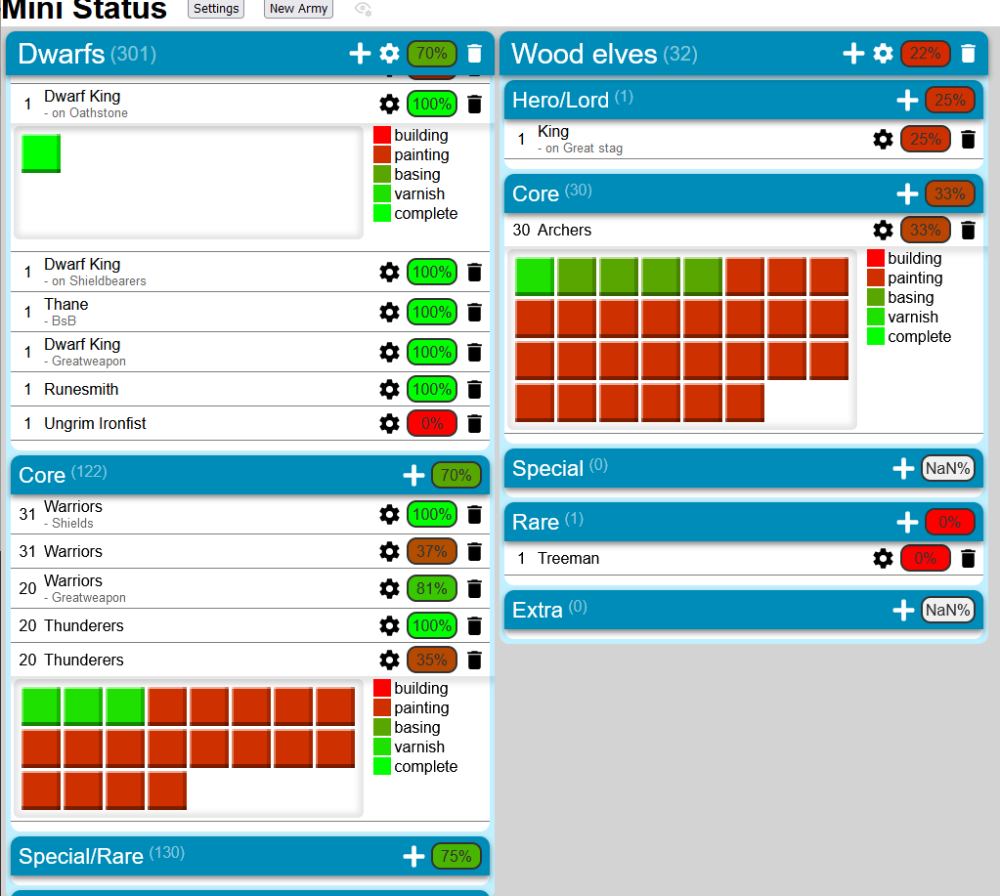
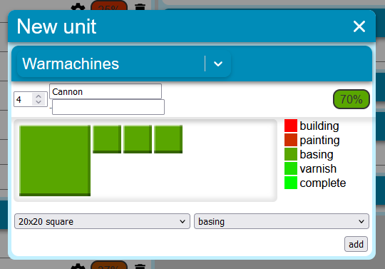

# miniWorkStatus project

This is my hobby project made with React and TypeScript. It is a tool used for keeping track of wargaming miniatures, and updating their statuses. 

## Backend

Proper backend has not been implemented yet. Currently I am using [JSON server](https://www.npmjs.com/package/json-server) as it provides all the functionality that I currently need out of the box (no authentication or scheme validation).

## Basic idea

The tool is used to track the progress of your wargaming miniature armies.

First you can customize your global settings:

 1. Bases: What different size of bases your miniatures have, such as 20mmx20mm rectangle or 50mm wide circle
 2. Statuses: What are the different states of your miniature projects, such as glued, base painted, colored, detailed, varnished, etc. and their percentage value of progress from out of the box to a complete miniature. 

Then you can start adding your armies, categories and units.

## UML 

The data is stored in the following data format:

## Showcase

General look of the project.

Adding a new unit customization popup.

## To Do
### Short term

- apply better css trough out the project
- reformat css to have universal constants and appearances
- add cascading removal of categories and units based on if an army is removed
- add functionality to drag and drop category and unit order and possibility to order units by either alphabetically or by done percentage.

### Long term

- create a server side functionality
- add users and authentication